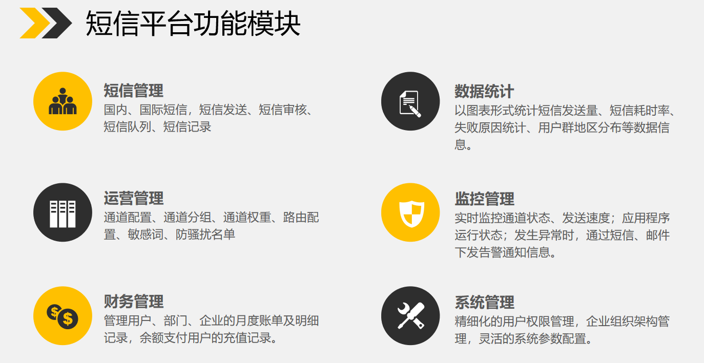
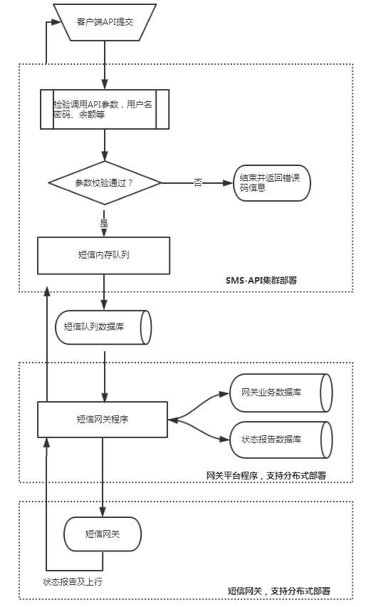
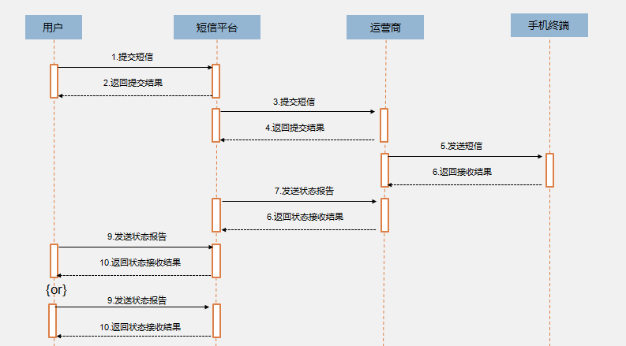
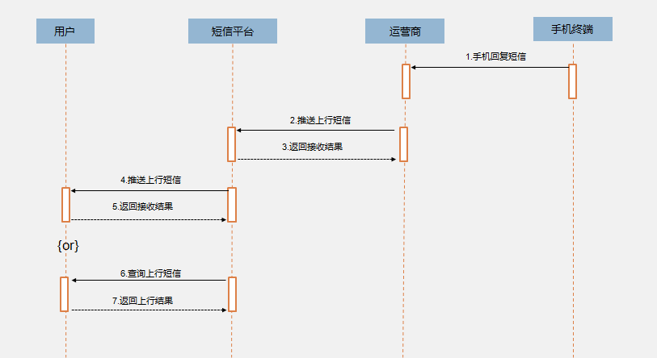

## 逻辑架构

逻辑架构着重考虑功能需求，系统应当向用户提供什么样的服务，关注点主要是行为或职责的划分。常用表达图形，静态图有包图、类图、对象图；动态图有序列图、协作图、状态图、活动图。逻辑架构的核心设计任务是模块划分、接口定义、领域模型细化。

常见问题：

+ 有哪些子系统或模块？
+ 系统之间是什么样的关系？
+ 对外上下游接口有哪些？对接人是谁？
+ 关键业务流程怎么实现的？用类图、序列图等方式表达出来。

***以短信服务为例***：  

短信服务为了满足不同的使用需求，功能框架可分为以下5个层次
+ 普通用户：提供了短信发送、短信记录、账单查询、数据统计、账户管理、账户设置等功能，方便了不同用户群体的基本需求
+ 运营管理：提供短信管理、运营管理、财务管理、监控管理、系统管理等，为了方便运营人员查询，配置，监控的操作
+ 应用程序：按功能划分，主要分为定时任务、网关程序、推送程序、同步程序
+ 数据中心：使用Oracle/Mysql进行持久化数据，数据库划分为四种，业务库、网关库、短信队列库和状态报告库
+ 基础服务：整个应用程序的基础环境，包含服务器、网络传输、数据存储等，保障了应用的稳定运行

短信平台具备功能：短信管理、数据统计、运营管理、监控管理、财务管理、系统管理等功能

缓存服务  
功能描述：通过直接使用内存队列来缓存页面及接口传递的短信数据，通过单线程获取内存队列数据批量持久化到数据库中，同时为防止应用因为各种因素导致服务挂掉，使用了JVM的shutdown hook进行序列化到磁盘中，当启动项目时，会重新加载序列化到磁盘的文件

### 平台核心数据流转

API核心功能实现  
1.所有业务系统调用接口、所有校验：账户合法性、号码合法性、内容合法性、发送时段等配置全在内存进行，没有进行任务DB操作  
2.校验完毕后，进行计费，在这里如果要求控制配额需要进行一次DB操作，若不需要则不需要操作DB  
3.计费完毕后直接把群发或单发的短信直接放入内存组件，然后直接返回客户端本次提交短信结果，响应毫秒级  
4.API使用单独的线程从内存队列取数据批量入库，异步处理

网关核心功能实现   
1.短信网关采用异步方式实现多通道并行处理发送  
2.每个通道配置一个内存队列，一般队列长度为通道速度的4~6倍  
3.网关由专门提升发送的线程根据网关下的通道队列判断，如果任务一个队列可用长度大于300时，从DB提取队列对应长度到待发送队列中  
4.每个通道配置多个发送线程，不断从待发送队列中取出数据发往运营商。发送完毕后把信息转移到已发送内存队列  
5.网关专门有接收响应线程，当异步接收到响应后与已发送队列配对,直接放入待入库内存队列  
6.专门单独的线程从待入库队列批量把已发送短信入库  
7.网关有专门状态报告线程接收运营商状态报告数据，所有接收状态均先入内存队列。再由独立线程从内存队列批量入库，暂不做处理  
8.最后由网关线程组，从状态库报告表取数据批量同步下行表  
9.所有数据处理采用内存操作，操作DB部分均采用批量处理  

短信发送业务流程  

短信回复业务流程  

