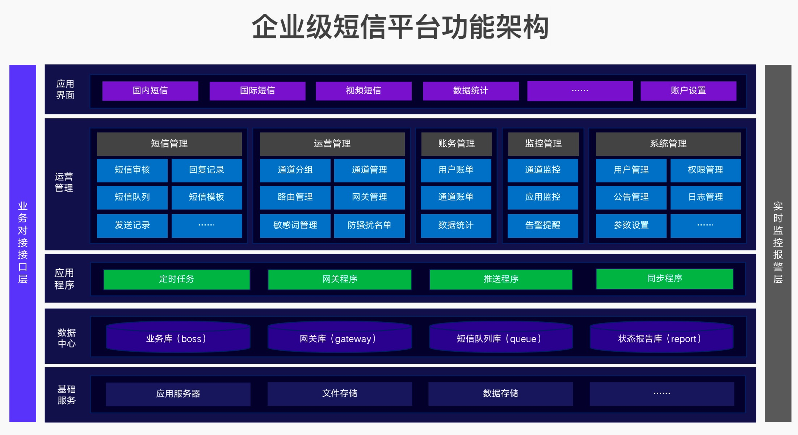

## 逻辑架构

逻辑架构着重考虑功能需求，系统应当向用户提供什么样的服务，关注点主要是行为或职责的划分。常用表达图形，静态图有包图、类图、对象图；动态图有序列图、协作图、状态图、活动图。逻辑架构的核心设计任务是模块划分、接口定义、领域模型细化。

常见问题：

+ 有哪些子系统或模块？
+ 系统之间是什么样的关系？
+ 对外上下游接口有哪些？对接人是谁？
+ 关键业务流程怎么实现的？用类图、序列图等方式表达出来。

系统之间的关系
