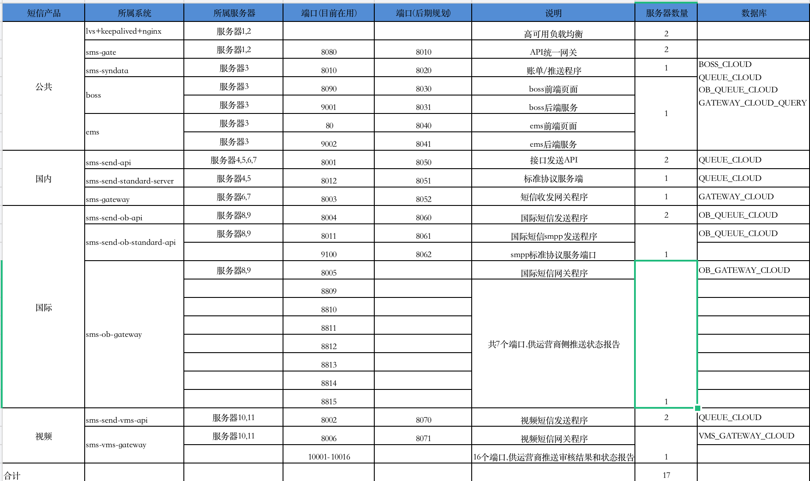

## 物理架构

物理架构的设计着重考虑安装和部署需求，关注点是目标程序及其依赖的运行库和系统软件最终如何安装或部署到物理机器，以及如何部署机器和网络来配合软件系统的可靠性、可伸缩性、持续可用性、性能和安全性等要求。

常见问题：

+ 系统如何发布部署？
+ 有哪些部署环境？
+ 系统有多少台机器？
+ 系统部署怎么部署的？关注接入层，部署方式，如集群部署、分布式部署等
+ 有没有容器化？
+ 有没有多机房部署？

### 微服务架构图

系统采用容器化部署方式，为了做持续的集成和部署，引入了jenkins，利用jenkins来构建应用的docker镜像并push到私有仓库，然后再基于应用的docker镜像来发布项目，这样减少了很多的手动操作，基本能实现持续集成和持续部署。

系统部署共有17台机器

