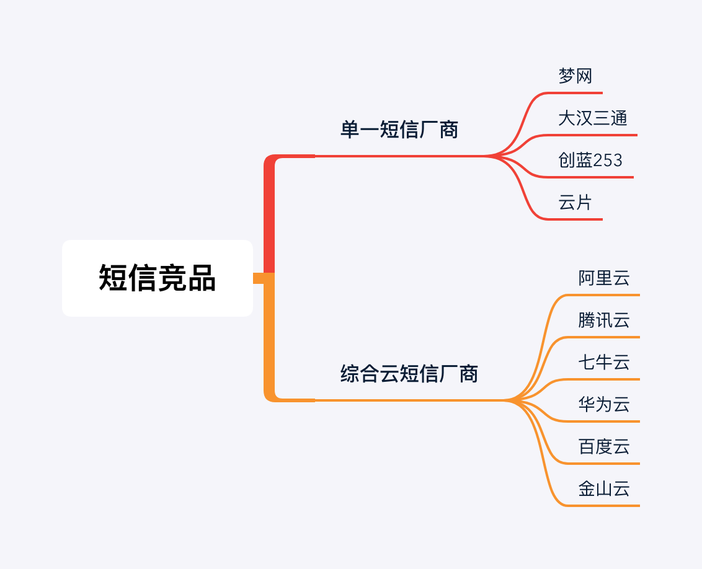
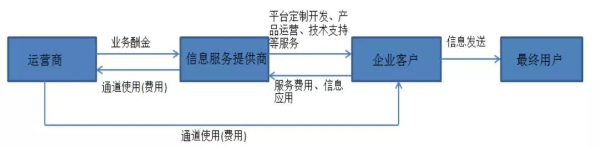
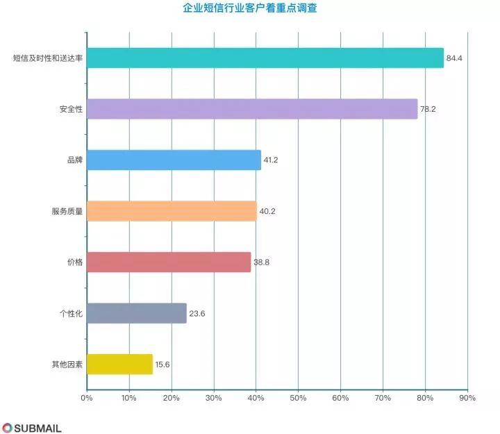
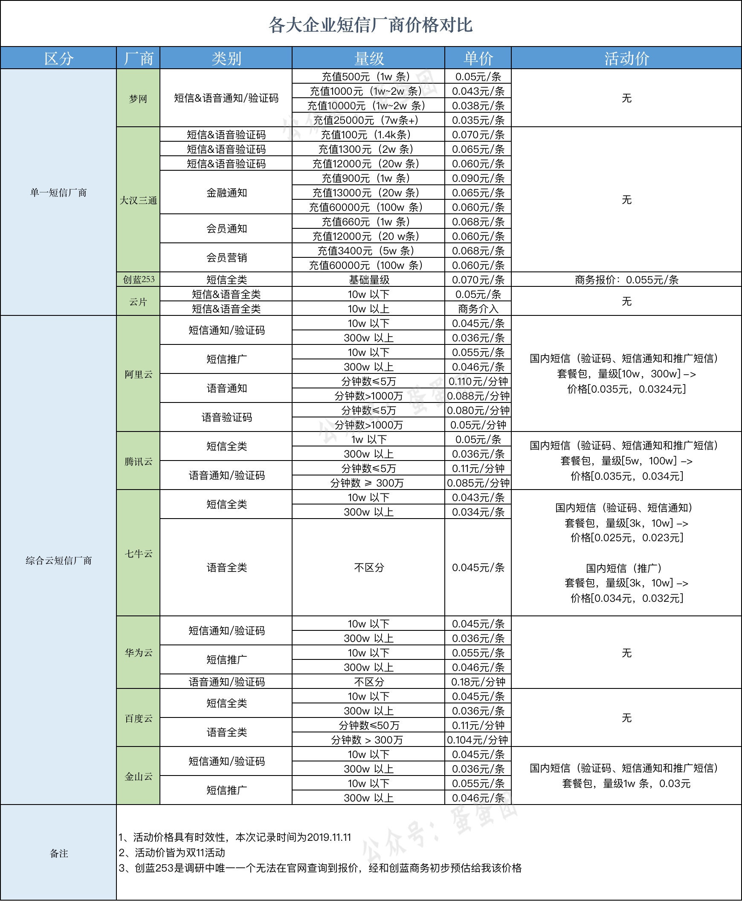
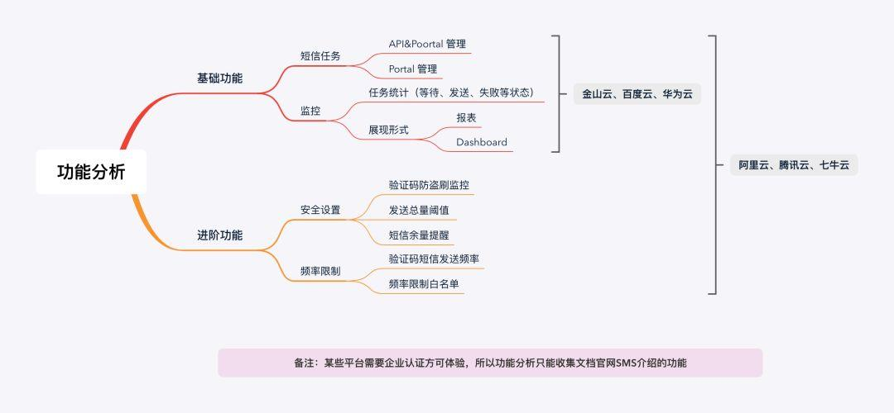
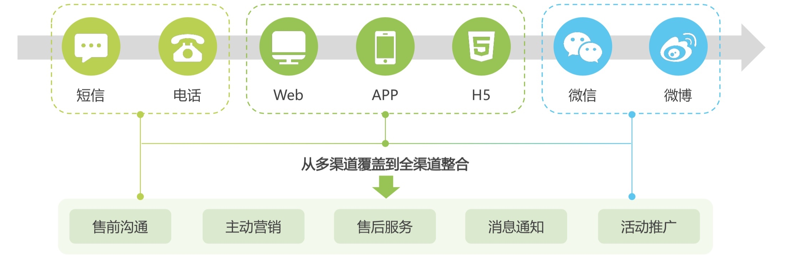

## 行业情况

**以短信平台为例**

### 一.业务分析

#### 1.1 背景
“【xxx】您的验证码是xxx（有效期5分钟）”。

上述验证码短信已经让我们习以为常，然而这只是企业短信最为常见的一个场景。

企业短信服务旨在解决企业运营过程中的信息传递与交流沟通问题，从传统的本地部署模式到如今基于云计算技术理念和服务模式提供的企业级云短信，云计算的资源共享、弹性扩展等特点充分发挥了企业短信降本增效价值和灵活扩展价值，进一步降低了企业接入门槛。

短信属于运营商业务，基于运营商资源的短信是企业在信息触达用户过程中所使用的最传统的通讯方式。而运营商签发的短信通道质量决定了短信质量，如到达率、到达时间等指标，不同运营商所签发的通道号码可以根据前面几位数字区分。

例如：

全网通道：「1069xxx」  
移动通道：『10657xxx』  
联通通道：『10655xxx』  
电信通道：「10659xxx，020xxx，0760xxx，0769xxx」  
不同通道又大致分为三种模式：固定独享通道、固定共享通道和随机共享通道。

以上，企业短信仍然属于高增长且高频业务，云计算厂商希望借力于短信的高频属性，将其打造为自身其他云业务的客户切入点和场景延伸，于是纷纷布局短信市场。同时利用自身平台优势接入多家短信代理商从而打造融合短信，最终通过负载均衡实现最优化调度

#### 1.2 应用场景
严格意义上，新一代短信包含了文本短信和语音短信，而默认短信为文本短信。

随着电话实名制的推行，手机号码已经被视为判断用户真实身份的关键依据，据工信部2017年发布的消息，全部电话用户均实现实名登记。因此，短信业务再度崛起，在身份验证和服务登陆场景下扮演着重要的角色。

文本短信主要分为短信通知、短信验证码和短信推广三大类。短信通知如物流、付款和登陆通知等等，验证码如注册、身份验证等，推广主要是通过活动进行用户唤醒和召回等等。

尽管语音短信有着低效和单价昂贵等缺点，且需要通过语音电话拨号的方式向用户传达信息导致用户抗拒，但是其到高达率以及防刷量等特性也让其成为了文本短信的有效补充
### 二.厂商分析
#### 2.1 分类
这里简单将短信厂商可分为两类，第一类是以短信为主营业务的厂商，这类企业营业额90%以上来源于短信业务，第二类是综合云短信厂商，其短信业务更多是作为场景延伸和生态完善。

第一类主要是梦网、大汉三通、创蓝253和云片等单一短信场景厂商，第二类是阿里云、腾讯云、七牛云、华为云、百度云和金山云等综合公有云厂商。

#### 2.2 盈利模式
国内企业短信服务厂商盈利主要来源于两点：运营商酬金（返利）和进销差价。

+ 运营商酬金（返利）：主要是指B端客户和运营商签约，采用代理商平台进行短信发送，按发送额获得运营商一定比例酬金；  
+ 进销差价：从运营商处批量采购短信，并转售给下游企业客户。

上图为企业短信厂商产业链，可以看的出，运营商对于下游企业的强主导性，而第三方短信厂商间最关键的竞争要素在于能否掌握质优价廉的运营商资源。

#### 2.3 短信客户选择因素调研
根据赛邮的一份公开调查数据表明，B端客户选择企业短信厂商最看重的两大因素分别是短信及时性&送达率和安全性。

而这两点也和目前企业短信主要用途是业务验证码有关，无论是身份验证和服务登陆都和B端客户业务数据息息相关。

目前业内各大短厂商官方宣称送达率普遍在95%以上，5秒内可达。
### 三.竞品比较
根据尼尔·博登提出的经典4P营销理论，产品（Product）、价格 (Price)、渠道(Place)和促销(Promotion)，价格和产品是决定市场接受度的核心因素。

这里由于某些限制无法得出产品质量（短信及时性&送达率和安全性），仅从价格侧略作分析。

由上图总结，以官方报价模式中，综合云短信厂商整体价格更具优势，这也符合综合云厂商对于企业短信的定位，将其视为自身业务的延伸以增加客户粘度。

而如七牛云新兴企业短信服务商更是在活动中将单价拉到了0.023元/条。

#### 3.2 功能对比
各厂商企业短信功能趋于同质化，最核心的功能即发送短信，完成这个步骤需要创建签名和模板，然后根据签名和模板发送短信。

由于单一短信厂商大部分需要企业认证，无法作进一步分析，上图数据仅包含综合云短信厂商。

### 四、总结
得益于媒介的发展，企业信息触达用户的手段也日益丰富，甚至于由短信和语音长期垄断格局被打破，如更多的企业希望通过社交工具代理代替短信营销。不可否认，客户服务与社交媒体的边界正在变得模糊。

然而对于某些特殊场景如身份认证和服务通知等，企业短信仍然是最佳选择。而对于云短信服务商而言，如何将自身短信业务从售前到转换甚至到流失后的召回从而覆盖客户服务全生命周期是一个值的深思的问题。

而且短信业务通过进销差价实现盈利，短信通道的质量很大程度又取决于运营商，所以各大企业短信厂商的核心竞争点在于掌握质优价廉的通道从而薄利多销。